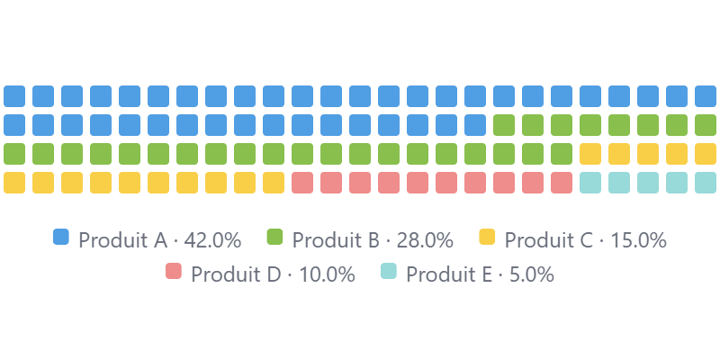

# Waffle Chart

A proportional grid visualization for Metabase that displays categorical data as colored cells in a waffle layout. Each cell represents a percentage or unit share of the total. Supports 6 cell shapes, animations, hover highlights, per-series color and label overrides, legend, and dark mode automatically.



## Requirements

- Metabase 1.62.0 or later (Pro or Enterprise plan)

---

## Installation

1. Download the latest `.tgz` from [Releases](../../releases/latest)
2. In Metabase, go to **Admin → Settings → Custom visualizations**
3. Click **Add visualization** and upload the `.tgz` file
4. The Waffle Chart visualization is now available in all questions and dashboards

---

## Usage

### 1. Write your query

The query must return **exactly 1 dimension column and 1 numeric column**, with one row per category.

```sql
-- Sales by product category
SELECT category, SUM(revenue) FROM orders GROUP BY category

-- Orders by status
SELECT status, COUNT(*) FROM orders GROUP BY status

-- Users by country (top 5)
SELECT country, COUNT(*) FROM users GROUP BY country ORDER BY 2 DESC LIMIT 5
```

### 2. Select the visualization

In the question editor, click the **visualization picker** (bottom left) and select **Waffle Chart**.

### 3. Configure the settings

Click the **gear icon** to open visualization settings. Settings are organized into sections.

#### Grid

| Setting | Description | Default |
|---------|-------------|---------|
| **Columns** | Number of columns in the grid | `20` |
| **Rows** | Number of rows in the grid | `5` |
| **Fill direction** | `Row, left to right` — fills left-to-right by row. `Column, bottom to top` — fills bottom-to-top by column | `Row, left to right` |

#### Cells

| Setting | Description | Default |
|---------|-------------|---------|
| **Cell shape** | Shape of each cell: `Rounded square`, `Square`, `Circle`, `Diamond`, `Cross`, `Star` | `Rounded square` |
| **Cell size** | `Auto` (fills the card), `XS` (8 px), `S` (12 px), `M` (18 px), `L` (26 px), `XL` (36 px) | `Auto` |

#### Data

| Setting | Description | Default |
|---------|-------------|---------|
| **Mode** | `Percent` — fills the grid proportionally (total = columns × rows cells). `Unit` — assigns 1 cell per N data units | `Percent` |
| **Units per cell** | In `Unit` mode: how many data units each cell represents | `1` |
| **Sort** | `Value descending` (largest first), `Value ascending` (smallest first), `Original order` | `Value descending` |
| **Minimum 1 cell per category** | Guarantees every non-zero category gets at least 1 cell, even if its share rounds down to 0 | On |

#### Legend

| Setting | Description | Default |
|---------|-------------|---------|
| **Show legend** | Show or hide the legend below the grid | On |
| **Legend value** | What to show per legend item: `Percent`, `Value`, or `Both` | `Percent` |

#### Series

Color and label overrides for each series present in the data (up to 4). Settings are shown dynamically — only the series that exist in the query results appear.

| Setting | Description |
|---------|-------------|
| **Series N — Color** | Custom color for series N |
| **Series N — Label** | Custom display name for series N (overrides the raw value from the query) |

Series are indexed in the sorted display order (as configured by the **Sort** setting).

---

## Capabilities

| Feature | Details |
|---------|---------|
| **Responsive sizing** | In `Auto` mode, cells scale to fill the card at any size — S, M, or L dashboard cards |
| **Fixed cell size** | Choose XS / S / M / L / XL for a consistent look across different card sizes |
| **6 cell shapes** | Rounded square, Square, Circle, Diamond, Cross, Star |
| **Reveal animation** | Each cell fades in with a staggered 7 ms delay (SVG-native `<animate>` — no CSS injection) |
| **Largest-remainder algorithm** | Guarantees cell counts sum exactly to the grid total (avoids off-by-one rounding errors) |
| **Hover highlight** | Hovering a cell or legend item fades out all other categories |
| **Tooltip** | Shows category name, raw value, and percentage on hover |
| **Drill-through** | Clicking a cell or legend item filters the dashboard by that category |
| **Dynamic legend** | Legend height adapts automatically — always fully visible, even when items wrap to multiple lines |
| **Dark mode** | Adapts automatically to Metabase's light and dark themes |
| **Dashboard sizing** | Minimum 3×3 · Default 6×4 dashboard units |

---

## Data requirements

| Column | Type | Notes |
|--------|------|-------|
| 1 | Text / Dimension | Category name — displayed in legend and tooltip |
| 2 | Numeric | The value to represent proportionally (raw count, sum, etc.) |

> The query must return at least 1 dimension and 1 numeric column. Categories with a value of 0 or less are ignored. Negative values are treated as 0.

---

## Development

```bash
npm install
npm run build          # produces waffle-chart-<version>.tgz
npm run preview:viz    # local preview server at http://localhost:5175
```

To develop against a live Metabase instance, enable dev mode:
```
MB_CUSTOM_VIZ_PLUGIN_DEV_MODE_ENABLED=true
```
Then set the dev server URL in **Admin → Settings → Custom visualizations → Development** to `http://localhost:5174`.

---

## License

MIT
